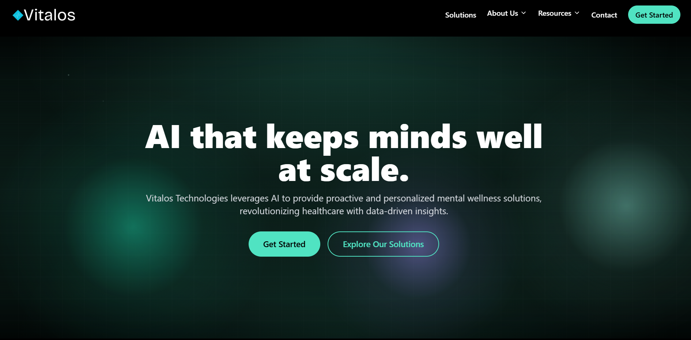
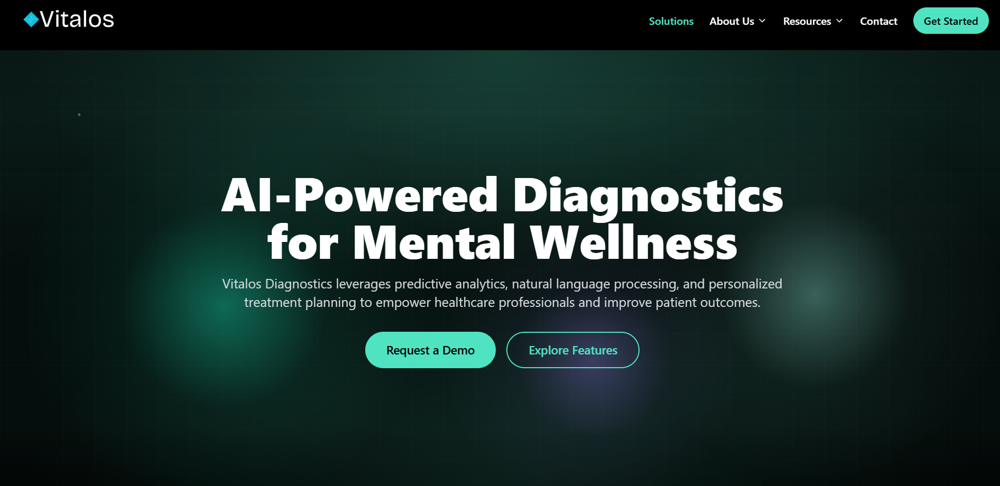

# 🌌 Vitalos — AI-Powered Mental Wellness Platform

Vitalos is a next-generation **AI-driven mental wellness platform**.  
It combines advanced machine learning, emotional sensing, and user-centric design to deliver **proactive, personalized, and scalable** support for mental health.

---

## 📸 Screenshots & Demo

  

  

👉 More screenshots and a live demo coming soon at [vitalos.co.uk](https://vitalos.co.uk)

---

## 🚀 Features

- 🎯 **AI Diagnostics** — Predictive analytics to detect mental health risks early.  
- 💬 **Natural Language Processing** — Analyze conversations and notes for emotional insights.  
- 📊 **Personalized Treatment Plans** — Tailored recommendations for therapy, lifestyle, and wellness.  
- 🌍 **Global Accessibility** — Scalable infrastructure designed for worldwide reach.  
- 🔒 **Ethical AI** — Privacy, transparency, and fairness at the core of our models.

---

## 🖥️ Tech Stack

- **Frontend:** React (TypeScript), Vite, TailwindCSS  
- **UI/UX:** Lucide Icons, ShadCN components, Framer Motion  
- **Architecture:** Component-based, stateful routing (React Hooks)  
- **Future Backends:** FastAPI / Node.js microservices with Kubernetes + CI/CD pipelines

---

🤝 Contributing
We welcome contributions! Please fork this repo, create a feature branch, and submit a PR.
For major changes, open an issue to discuss first.

📜 License
This project is licensed under the MIT License.

🌐 Links
Website: vitalos.co.uk

LinkedIn: Vitalos Technologies

Twitter: @VitalosAI

💡 Inspiration
AI that keeps minds well at scale.
Vitalos is built to bridge the gap between mental health challenges and scalable, ethical AI solutions.
